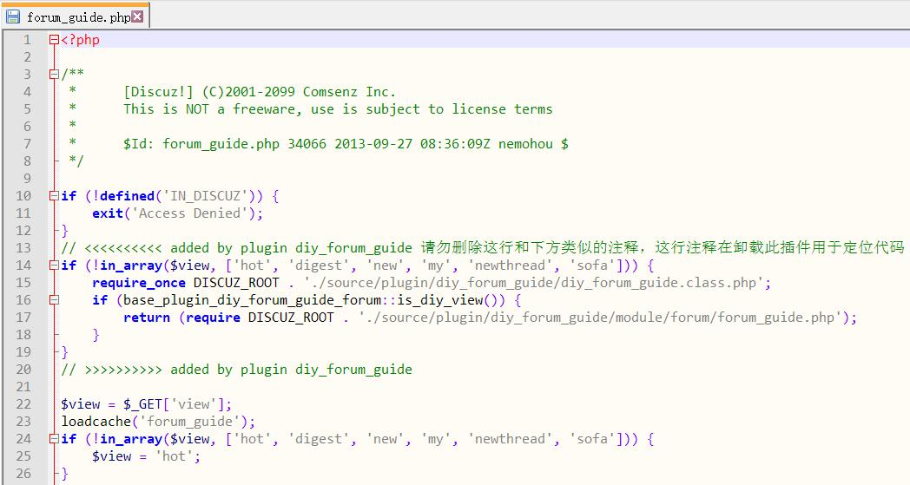

# 自定义论坛导读

在 `forum.php?mod=guide` 中添加新的分类


## 使用

1. 解压到 `DiscuzX/upload/source/plugin/diy_forum_guide`

2. 在 DiscuzX 管理中心中安装并启用插件

3. 如果您的 `DiscuzX/upload/source/module/forum/forum_guide.php` 是可写的，会自动安装好插件。

    如果提示写入错误，那么请手动在上述文件的这句代码之后

    ```php
    if (!defined('IN_DISCUZ')) {
        exit('Access Denied');
    }
    ```
    
    添加这些代码
    
    ```php
    // <<<<<<<<<< added by plugin diy_forum_guide 请勿删除这行和下方类似的注释，这行注释在卸载此插件用于定位代码
    if (!in_array($view, ['hot', 'digest', 'new', 'my', 'newthread', 'sofa'])) {
        require_once DISCUZ_ROOT . './source/plugin/diy_forum_guide/diy_forum_guide.class.php';
        if (base_plugin_diy_forum_guide_forum::is_diy_view()) {
            return (require DISCUZ_ROOT . './source/plugin/diy_forum_guide/module/forum/forum_guide.php');
        }
    }
    // >>>>>>>>>> added by plugin diy_forum_guide
    ```

    结果类似这样

    

4. 在插件设置中设置自定义的分类

## 卸载

卸载通常也是自动进行的，如果 `forum_guide.php` 不可写，那么手动删除上述添加的代码即可。

## License

    diy_forum_guide
    Copyright (C) 2018  Ganlv

    This program is free software: you can redistribute it and/or modify
    it under the terms of the GNU Affero General Public License as published by
    the Free Software Foundation, either version 3 of the License, or
    (at your option) any later version.

    This program is distributed in the hope that it will be useful,
    but WITHOUT ANY WARRANTY; without even the implied warranty of
    MERCHANTABILITY or FITNESS FOR A PARTICULAR PURPOSE.  See the
    GNU Affero General Public License for more details.

    You should have received a copy of the GNU Affero General Public License
    along with this program.  If not, see <https://www.gnu.org/licenses/>.
